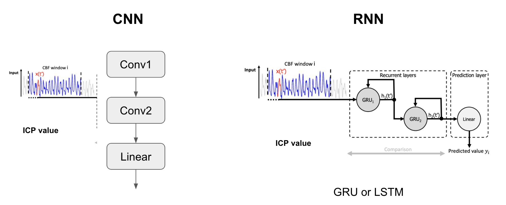

## Estimation of Intracranial pressure (ICP) with Recurrent Neural Networks (RNNs)
#### by Amelia Jiménez-Sánchez, Jonas Fischer

<p align="center"></p>

## Requirements:
- Python 3.5+
- TensorFlow 1.4+
- PyTorch 0.4.1+
- Tensorboardx
- Sklearn
- Pandas
- Csv
- Numpy

## Usage
### 1. Cloning the repository
```bash
$ git clone https://github.com/4ofmedina/icp_dann.git
$ cd icp_dann/
```

### 2. Preprocessing
#### 2.1 Window extraction from raw data
Raw data is located under `./data_TBI/`. Blood flow and ICP values are storaged as txt files. We extract windows to further process this data with RNNs. Extracted windows are located under `./results/` as npz files. To change the stride or window size, use the `stride` or `win` arguments, respectively.  
```bash
$ python calcInputWindows.py
```

#### 2.2 Write data to csv file
This script reads the structured data and save it as a csv file. Change the `filename` argument to modify the name of the csv file.
```bash
$ python write_data_to_csv_file.py
```

#### 2.3 Split window data into training, validation and test sets
Data is splitted into 70%, 10% and 20% for training, validation and test, respectively. Basically, the previous csv file is separated into three: `flows-train`, `flows-val` and `flows-test`, located under `./RNN/data`. To modify the percentages, change the `test_size` argument in the function `train_test_split`. 
```bash
$ python split_train_val_test.py
```

### 3. Training a Neural Network
#### 3.1 Loading the data
```bash
$ trainset = BloodFlow(csv_file='flows-train.csv', root_dir='./data', transform=ToTensor())
```

#### 3.2 Model definition
Several models are defined in `networks.py` script. 
To define a **basic CNN**: 
```bash
$ model = FlowCNN()
```

We can add, as regularization of the embedding space, a loss to **reconstruct the input blood flow**. For this, we define a criterion for the reconstruction loss `criterion_reco = nn.L1Loss()`, and formulate our optimization problem as a weighted combination of the two losses `loss = loss1 + 0.5*loss2`, where `loss1` refers to the regression task and `loss2` to the reconstruction. These losses can be tracked either independently or together in the train and validation `writers`.
```bash
$ model = FlowCNNRecons()
```
To define a **LSTM**, we specify the batch size of the network with `BATCH_SIZE`, the size of the sequence with `N_STEPS`, the dimension of the output `N_OUTPUTS` and the number of neurons in the hidden layer `N_NEURONS`.
```bash
$ model = LSTM(batch_size=BATCH_SIZE, input_dim=N_STEPS, output_dim=N_OUTPUTS, hidden_dim=N_NEURONS)
```

#### 3.3. Training
Load the training and validation data, specify the network, and use `exp_name` argument to name your experiment to be stored in `PATH`, e.g. `PATH = "./models/lstm/"`.
```bash
$ python RNN/train.py
```

To visualize the evolution of train and validation losses over the epochs:
```bash
$ tensorboard --logdir=PATH
```
where `PATH` is the experiment path specified in `train.py`.


#### 3.4. Test
To restore and test a model, load the test data, define the network, and from where models should be restored with `PATH` argument.
```bash
$ python RNN/test.py
```

#### 3.5. Visualize predictions
To visualize the performance of the model by ploting the predictions over the data:
```bash
$ python RNN/plot_test_results.py
```

